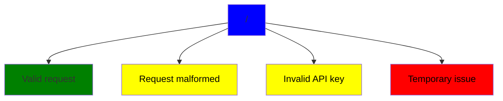

```mermaid
graph TD
    A["/"]
    A --> B[Valid request]
    A --> C["Request malformed"]
    A --> D["Invalid API key"]
    A --> E["Temporary issue"]

    style A fill:blue
    style B fill:green

    classDef yellow fill:yellow,color:black
    class C,D yellow

    style E fill:red,color:black
```
