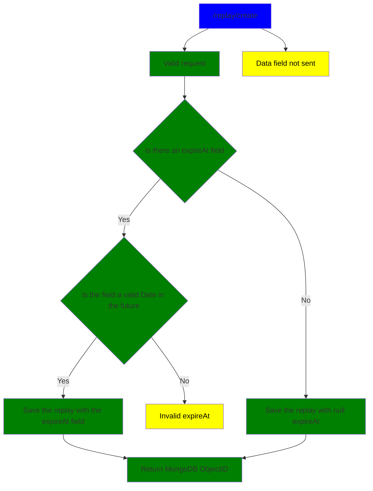
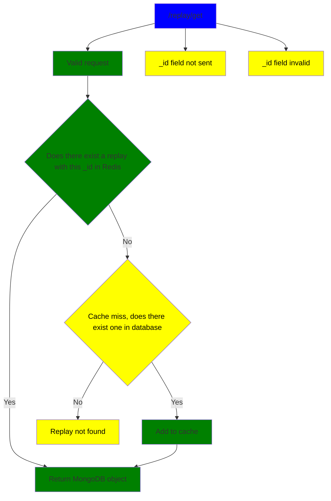
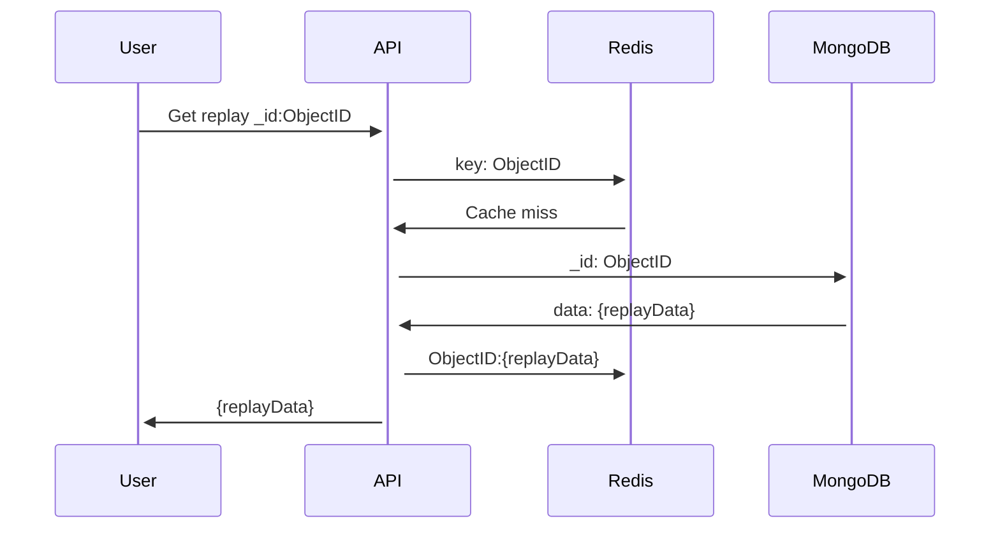

```mermaid
graph TD
    A["/replay/create"]
    A --> B[Valid request]
    A --> C["Data field not sent"]

    B --> G{Is there an expireAt field}
    G --> |Yes| H{"Is the field a valid Date in the future"}
    G --> |No| I["Save the replay with null expireAt"]

    H --> |Yes| J["Save the replay with the expireAt field"]
    H --> |No| K["Invalid expireAt"]

    J --> L["Return MongoDB ObjectID"]

    I --> L

    style A fill:blue

    classDef green fill:green
    class B,G,H,I,J,L green

    classDef yellow fill:yellow,color:black
    class C,K yellow
```

```mermaid
graph TD
    A["/replay/get"]
    A --> B[Valid request]
    A --> C["_id field not sent"]
    A --> D["_id field invalid"]

    B --> E{Does there exist a replay with this _id in Redis}
    E --> |Yes| F["Return MongoDB object"]
    E --> |No| G{"Cache miss, does there exist one in database"}

    G --> |Yes| H["Add to cache"]
    H --> F
    G --> |No| I["Replay not found"]

    style A fill:blue

    classDef green fill:green
    class B,E,F,H green

    classDef yellow fill:yellow,color:black
    class C,D,G,I yellow
```

```mermaid
sequenceDiagram
    User->>+API: Get replay _id:ObjectID
    API->>+Redis: key: ObjectID
    Redis->>+API: Cache miss
    API->>+MongoDB: _id: ObjectID
    MongoDB->>+API: data: {replayData}
    API->>+Redis: ObjectID:{replayData}
    API->>+User: {replayData}
```
