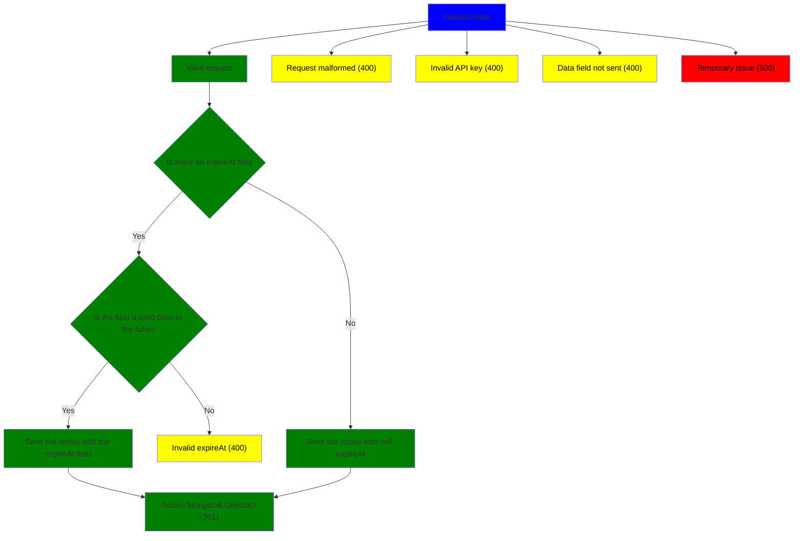

```mermaid
graph TD
    A["/replay/create"]
    A --> B[Valid request]
    A --> C["Request malformed (400)"]
    A --> D["Invalid API key (400)"]
    A --> E["Data field not sent (400)"]
    A --> F["Temporary issue (500)"]

    B --> G{Is there an expireAt field}
    G --> |Yes| H{"Is the field a valid Date in the future"}
    G --> |No| I["Save the replay with null expireAt"]

    H --> |Yes| J["Save the replay with the expireAt field"]
    H --> |No| K["Invalid expireAt (400)"]

    J --> L["Return MongoDB ObjectID (201)"]

    I --> L

    style A fill:blue

    classDef green fill:green
    class B,G,H,I,J,L green

    classDef yellow fill:yellow,color:black
    class C,D,E,K yellow

    style F fill:red,color:black
```
